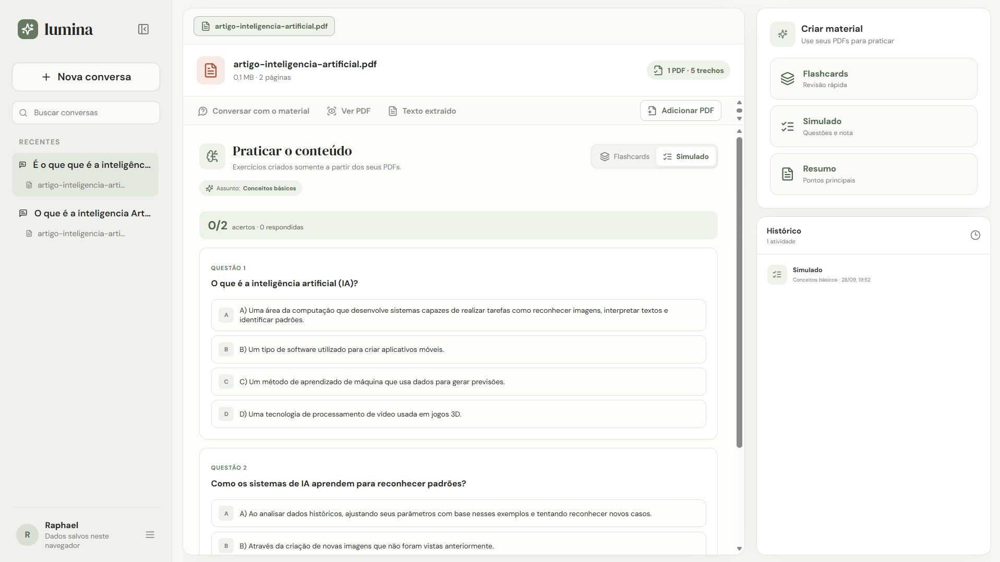

<div align="center">

# ✦ Lumina

### A private, local-first AI study workspace for your PDFs

Chat with your documents, find relevant passages, and generate summaries, flashcards, and quizzes—all powered by local AI through Ollama.

[](https://react.dev/)
[](https://www.typescriptlang.org/)
[](https://ollama.com/)
[](LICENSE)

</div>



## About Lumina

Lumina turns PDF files into an interactive study workspace. Each conversation can contain multiple documents, and every answer is grounded in the material you uploaded. The app runs its language and embedding models locally, so no paid AI API is required.

The interface currently targets Brazilian Portuguese, while this documentation is maintained in English.

## Highlights

| Feature | What it does |
| --- | --- |
| Grounded document chat | Answers questions using retrieved passages from your PDFs and displays the source document and page. |
| Multiple PDFs | Keeps several documents inside the same conversation and searches across all of them. |
| Semantic search | Uses local embeddings to find passages by meaning instead of relying only on exact keywords. |
| Query rewriting | Ollama rewrites informal, misspelled, or contextual questions before retrieval. |
| Study materials | Generates topic-focused flashcards, quizzes, and summaries from the selected documents. |
| Conversation management | Creates, searches, renames, switches, and deletes independent study conversations. |
| Persistent history | Stores documents, messages, embeddings, and generated materials in IndexedDB. |
| Document viewer | Lets you switch between the original PDF and page-preserving extracted text. |
| Voice controls | Supports speech-to-text for questions and text-to-speech for AI responses. |
| Personalization | Includes light and dark themes, a collapsible sidebar, and an editable profile name. |

## How the RAG pipeline works

Lumina uses Retrieval-Augmented Generation (RAG) to keep answers connected to the source material:

1. A PDF is uploaded and its text is extracted page by page.
2. The text is split into overlapping chunks while preserving the document and page references.
3. Ollama generates an embedding for each chunk.
4. The chunks and embeddings are stored locally in IndexedDB.
5. When a question is submitted, the app rewrites it into a clearer search query when necessary.
6. The question embedding is compared with the stored embeddings using cosine similarity.
7. The most relevant passages are sent to the local language model as context.
8. The answer is displayed with the documents and pages that supported it.

If the retrieved material is not sufficient, Lumina is instructed to say so instead of inventing an answer.

## Tech stack

- **Frontend:** React, TypeScript, Vite, and Lucide icons
- **Backend:** Node.js, Express, TypeScript, and Zod
- **PDF extraction:** PDF.js
- **Local AI:** Ollama
- **Chat model:** `qwen3.5:0.8b` by default
- **Embedding model:** `nomic-embed-text-v2-moe` by default
- **Persistence:** IndexedDB in the browser
- **Testing:** Node.js test runner through TSX

## Requirements

- [Node.js](https://nodejs.org/) 20 or newer
- [Ollama](https://ollama.com/download) installed and running
- A modern browser such as Chrome or Edge
- Approximately 2 GB of free disk space for the default local models

## Getting started

### 1. Clone and install

```powershell
git clone https://github.com/raphaeld0/lumina.git
cd lumina
npm.cmd install
```

### 2. Download the local models

```powershell
ollama pull qwen3.5:0.8b
ollama pull nomic-embed-text-v2-moe
```

### 3. Create the environment file

```powershell
Copy-Item .env.example .env
```

The default configuration is:

```env
OLLAMA_BASE_URL=http://127.0.0.1:11434
OLLAMA_MODEL=qwen3.5:0.8b
OLLAMA_EMBEDDING_MODEL=nomic-embed-text-v2-moe
PORT=3001
```

### 4. Start Lumina

```powershell
npm.cmd run dev
```

Open [http://localhost:5173](http://localhost:5173) in your browser. The frontend and local API start together.

> **PowerShell note:** if `npm run dev` reports that `npm.ps1` cannot be executed, use `npm.cmd run dev`. This avoids changing your system execution policy.

## Using the app

1. Create a conversation.
2. Upload one or more text-based PDF files.
3. Wait for extraction and indexing to finish.
4. Ask a question about the material, including informal or contextual follow-ups.
5. Open the source references to verify the supporting document and page.
6. Choose **Flashcards**, **Quiz**, or **Summary**, enter a topic such as “RAG” or “Basic concepts,” and generate a study activity.

Scanned PDFs that contain only images cannot be read yet. Lumina detects this case and displays a clear limitation message instead of creating empty content.

## Available commands

| Command | Description |
| --- | --- |
| `npm.cmd run dev` | Starts the Vite frontend and Express API in development mode. |
| `npm.cmd run build` | Creates production builds for the frontend and server. |
| `npm.cmd start` | Starts the compiled production server. |
| `npm.cmd test` | Runs the automated test suite. |
| `npm.cmd run lint` | Checks the project with ESLint. |
| `npm.cmd run preview` | Serves the frontend production build locally. |

## Project structure

```text
lumina/
├── server/
│   ├── index.ts             # Express API and Ollama integration
│   ├── rag.ts               # Prompt construction and grounded answers
│   ├── practice.ts          # Flashcard and quiz generation
│   ├── summary.ts           # Summary generation
│   └── *.test.ts            # Server-side tests
├── src/
│   ├── components/          # Chat, documents, navigation, and study UI
│   ├── lib/
│   │   ├── pdf.ts           # Page-aware PDF extraction
│   │   ├── search.ts        # Chunking, embeddings, and retrieval
│   │   ├── storage.ts       # IndexedDB schema and persistence
│   │   └── rag.ts           # Frontend RAG client
│   ├── App.tsx
│   └── styles.css
├── .env.example
└── package.json
```

## Privacy and local storage

Documents, extracted text, embeddings, conversations, and generated study materials remain in your browser and local Ollama instance. Lumina does not require an OpenAI key or a hosted database.

Browser speech recognition may use an online service provided by the browser vendor. If strict offline use is required, avoid the microphone feature. Clearing the site's browser data also removes Lumina's locally saved conversations.

## Current limitations

- Image-only and scanned PDFs require OCR, which is not implemented yet.
- Local generation speed depends on your CPU, GPU, RAM, and selected Ollama model.
- Browser data is not synchronized between devices.
- AI output can still be imperfect; source references should be checked for important study material.

## Roadmap

- OCR for scanned documents
- Import and export of conversations
- Notes, highlights, and bookmarks
- Direct navigation from a citation to its PDF page
- Spaced repetition for flashcards
- Installable PWA and offline improvements

## Contributing

Issues and pull requests are welcome. Before submitting a change, run:

```powershell
npm.cmd run lint
npm.cmd test
npm.cmd run build
```

Commit messages follow the [Conventional Commits](https://www.conventionalcommits.org/en/v1.0.0/) format.

## License

Lumina is available under the [MIT License](LICENSE).
